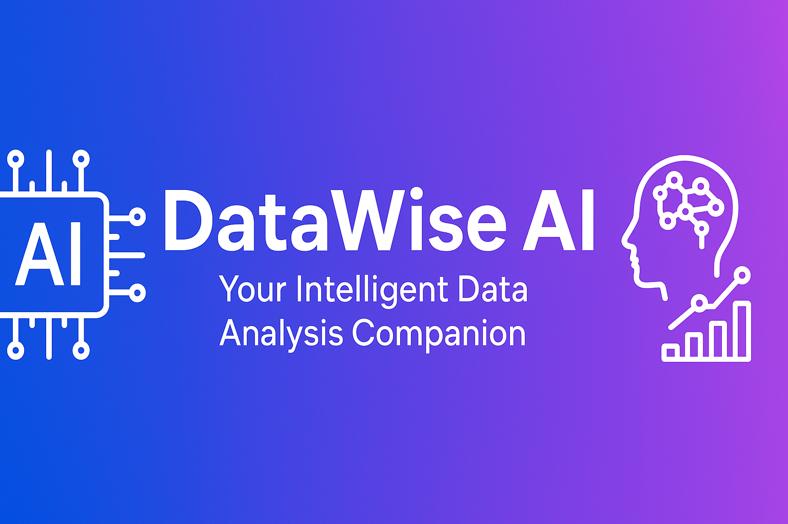
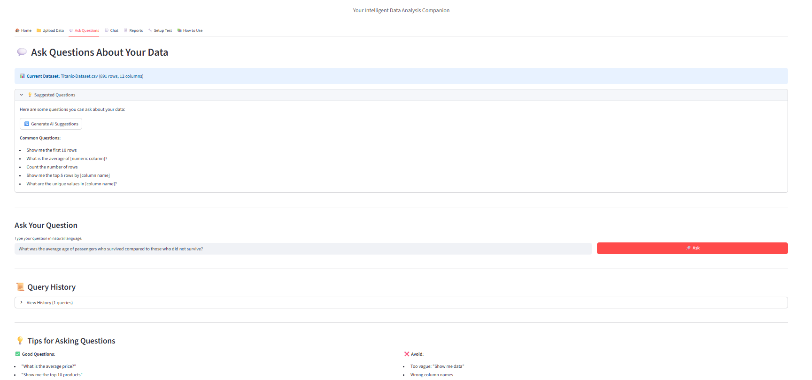
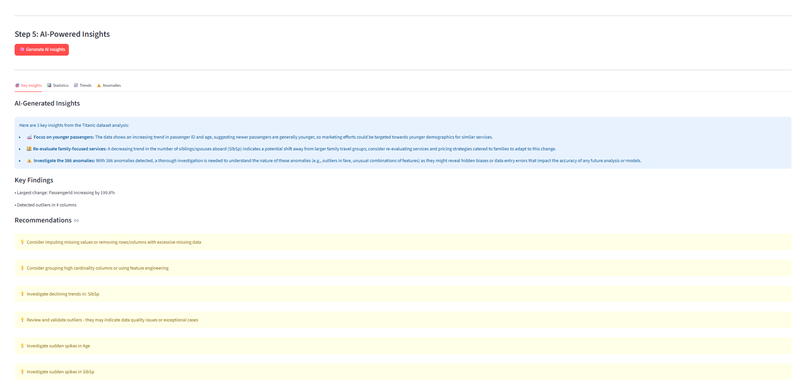
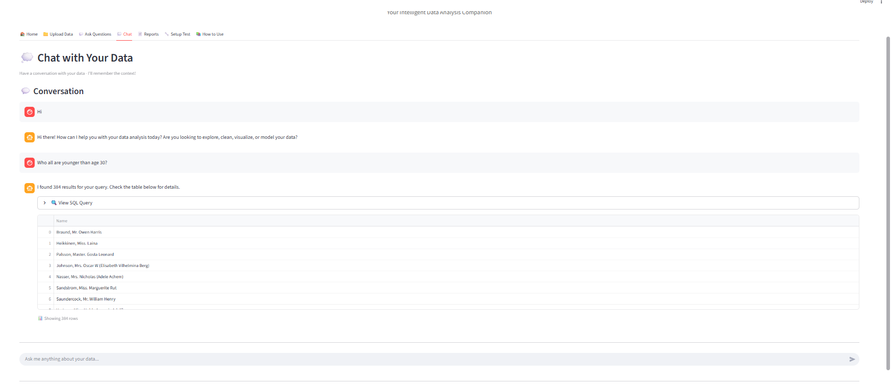
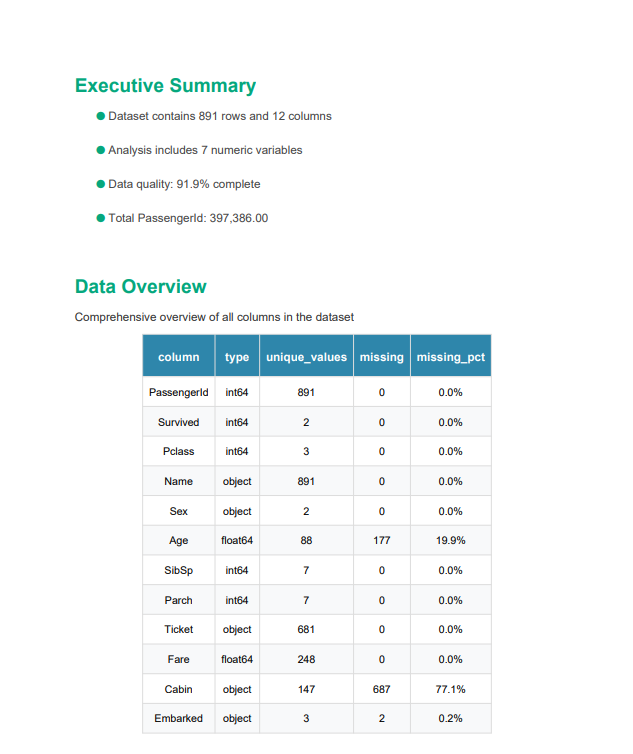
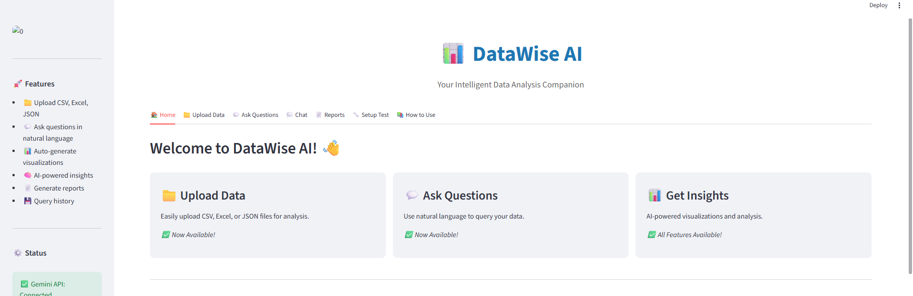
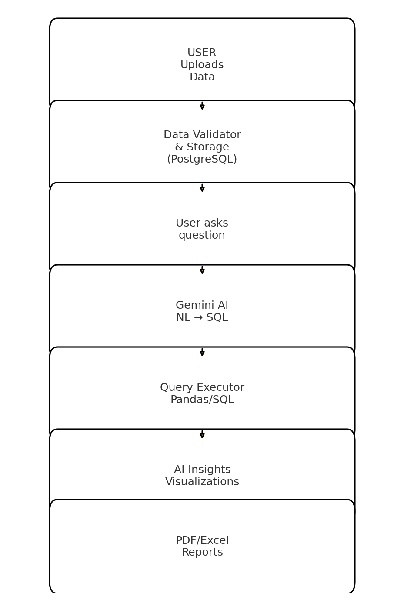

## Project Status: Completed

This project is now complete as of 2025-10-08.

# 🚀 DataWise AI - Your Intelligent Data Analysis Companion

<div align="center">

<!-- Add your banner image here -->



[](https://www.python.org/)
[](https://streamlit.io/)
[](https://ai.google.dev/)
[](https://www.postgresql.org/)
[](LICENSE)

**Transform your data into insights with natural language - No SQL knowledge required!**

[Demo](#-demo) • [Features](#-features) • [Installation](#-installation) • [Usage](#-usage) • [Tech Stack](#-tech-stack)

</div>

---

## 🎯 What is DataWise AI?

DataWise AI is an **AI-powered data analysis platform** that lets you analyze your data using natural language. Upload your CSV, Excel, or JSON files, ask questions in plain English, and get instant insights, visualizations, and professional reports.

**Perfect for:**

- 📊 Data Analysts who want to speed up analysis
- 💼 Business Users without SQL knowledge
- 🎓 Students learning data science
- 🚀 Startups needing quick insights

---

## ✨ Demo


**Try it live:** [DataWise AI on Streamlit Cloud](#) _(Coming soon)_

**Video Demo:** [Watch on Google Drive](https://drive.google.com/file/d/1kKBmpyrwb2x4uP744o0wxdqydGuBY-Uo/view?usp=sharing)

---

## 🌟 Key Features

<table>
<tr>
<td width="50%">

### 💬 Natural Language Queries

Ask questions in plain English:

- "What are the top 10 customers by revenue?"
- "Show me sales trends for last quarter"
- "Which products have declining sales?"



</td>
<td width="50%">

### 🤖 AI-Powered Insights

Automatic discovery of:

- 📈 Trends and patterns
- ⚠️ Anomalies and outliers
- 🔍 Correlations
- 💡 Actionable recommendations



</td>
</tr>
<tr>
<td width="50%">

### 📊 Smart Visualizations

- Auto-generated charts
- Interactive plots with Plotly
- Multiple chart types
- One-click export


</td>
<td width="50%">

### 💭 Conversational Chat

- Multi-turn conversations
- Context-aware responses
- Semantic search with ChromaDB
- Chat history tracking



</td>
</tr>
<tr>
<td width="50%">

### 📄 Professional Reports

- PDF & Excel export
- Auto-generated summaries
- Charts and statistics
- Share with stakeholders



</td>
<td width="50%">

### 🔒 Secure & Reliable

- PostgreSQL backend
- Data validation
- Error handling
- Query history tracking



</td>
</tr>
</table>

---

## 🏗️ Architecture



**Tech Flow:**

1. **User uploads data** → Validated & stored in PostgreSQL
2. **User asks question** → Gemini AI converts to SQL
3. **Query executed** → Results formatted & visualized
4. **AI analyzes** → Insights, trends, anomalies detected
5. **Reports generated** → PDF/Excel with charts

---

## 🚀 Quick Start

### Prerequisites

- Python 3.10 or higher
- PostgreSQL 15+
- Google Gemini API Key ([Get free key](https://aistudio.google.com/app/apikey))

### Installation

```bash
# 1. Clone the repository
git clone https://github.com/Kishor129129/datawise_ai.git
cd datawise_ai

# 2. Create virtual environment
python -m venv venv

# Windows
venv\Scripts\activate

# Linux/Mac
source venv/bin/activate

# 3. Install dependencies
pip install -r requirements.txt

# 4. Set up PostgreSQL database
# Create database named 'datawise_ai'
# Then run:
python database/init_database.py

# 5. Configure environment variables
# Create .env file with:
# GEMINI_API_KEY=your_key_here
# DB_HOST=localhost
# DB_PORT=5432
# DB_NAME=datawise_ai
# DB_USER=postgres
# DB_PASSWORD=your_password

# 6. Run the application
streamlit run app.py
```

The app will open at `http://localhost:8501`

---

## 📖 Usage Guide

### 1️⃣ Upload Data


- Supports CSV, Excel (.xlsx, .xls), JSON
- Auto-validation and cleaning
- Preview with statistics
- Auto-saved to PostgreSQL

### 2️⃣ Ask Questions


```
Examples:
• "How many records are there?"
• "Show top 5 rows"
• "What's the average age?"
• "Which category has highest sales?"
• "Compare revenue by region"
```

### 3️⃣ Chat with Your Data


- Conversational interface
- Multi-turn dialogues
- Context-aware responses
- Semantic search powered by ChromaDB

### 4️⃣ Generate Insights


Automatic analysis including:

- **Key Statistics:** Mean, median, correlations
- **Trends:** Increasing, decreasing, stable
- **Anomalies:** Outliers detected via IQR/Z-score
- **Recommendations:** Data-driven suggestions

### 5️⃣ Create Reports


- Professional PDF reports
- Excel exports with multiple sheets
- Include charts, statistics, insights
- One-click download

---

## 🛠️ Tech Stack

### Core Technologies

| Category            | Technologies                        |
| ------------------- | ----------------------------------- |
| **Frontend**        | Streamlit, HTML/CSS                 |
| **AI/ML**           | Google Gemini AI, LangChain         |
| **Databases**       | PostgreSQL, ChromaDB (Vector Store) |
| **Data Processing** | Pandas, NumPy, PandasSQL            |
| **Visualization**   | Plotly, Matplotlib, Seaborn         |
| **Export**          | ReportLab, FPDF2, OpenPyXL          |
| **Logging**         | Loguru                              |

### Key Dependencies

```txt
streamlit==1.32.0
google-generativeai==0.4.0
langchain==0.1.11
langchain-google-genai==0.0.9
pandas==2.2.0
numpy==1.26.4
plotly==5.19.0
psycopg2-binary==2.9.9
chromadb==0.4.22
sqlalchemy==2.0.27
sentence-transformers==2.5.1
```

---

## 📁 Project Structure

```
datawise_ai/
├── app.py                      # Main Streamlit application
├── config.py                   # Configuration management
├── requirements.txt            # Python dependencies
├── .env                        # Environment variables (not in git)
├── .gitignore                 # Git ignore rules
│
├── database/                   # Database layer
│   ├── postgres_handler.py    # PostgreSQL operations
│   ├── vector_store.py        # ChromaDB vector store
│   ├── models.py              # SQLAlchemy ORM models
│   ├── schema.sql             # Database schema
│   └── init_database.py       # DB initialization script
│
├── ai_engine/                  # AI & NL processing
│   ├── gemini_handler.py      # Gemini AI wrapper
│   ├── nl_to_sql.py           # Natural Language to SQL
│   ├── query_executor.py      # Query execution engine
│   └── prompts.py             # Prompt templates
│
├── visualization/              # Charts & visualizations
│   ├── chart_generator.py     # Chart creation
│   └── chart_customizer.py    # Chart styling
│
├── insights/                   # AI insights engine
│   ├── insight_generator.py   # Orchestrates insights
│   ├── statistical_analyzer.py # Statistical analysis
│   ├── trend_analyzer.py      # Trend detection
│   └── anomaly_detector.py    # Anomaly detection
│
├── chat/                       # Conversational interface
│   ├── chat_handler.py        # Chat processing
│   └── conversation_manager.py # Context management
│
├── reports/                    # Report generation
│   ├── report_generator.py    # Report orchestration
│   ├── pdf_exporter.py        # PDF export
│   └── excel_exporter.py      # Excel export
│
├── utils/                      # Utility functions
│   ├── file_processor.py      # File upload handler
│   ├── data_validator.py      # Data validation
│   └── data_preview.py        # Data preview
│
├── sample_data/               # Sample datasets
│   ├── sales_data.csv
│   └── titanic.csv
│
├── uploads/                   # User uploaded files
├── chroma_data/              # Vector database storage
└── logs/                     # Application logs
```

---

## 🎯 Development Roadmap

### ✅ Completed Features

- [x] **Phase 1:** Project setup, config, Gemini integration
- [x] **Phase 2:** PostgreSQL schema, SQLAlchemy models
- [x] **Phase 3:** File upload (CSV/Excel/JSON), validation
- [x] **Phase 4:** Natural Language to SQL, query execution
- [x] **Phase 5:** Interactive visualizations with Plotly
- [x] **Phase 6:** AI insights, trend detection, anomalies
- [x] **Phase 7:** Chat interface with ChromaDB
- [x] **Phase 8:** PDF/Excel report generation

### 🚧 Current Focus (Phase 10)

- [ ] Deploy to Streamlit Cloud
- [ ] Create demo video/GIF
- [ ] Add screenshots to README
- [ ] Performance optimization
- [ ] Final documentation polish

### 🔮 Future Enhancements

- [ ] Multi-user authentication
- [ ] Dashboard creation & saving
- [ ] Scheduled report generation
- [ ] Email integration for reports
- [ ] Support for more file formats (Parquet, Feather)
- [ ] API endpoint for programmatic access
- [ ] Mobile-responsive design
- [ ] Dark mode theme

---

## 🧪 Testing

The project includes comprehensive testing for:

- ✅ Edge cases in chat intent detection
- ✅ Natural Language to SQL conversion
- ✅ Data validation and cleaning
- ✅ Query security (SQL injection prevention)
- ✅ Database storage verification
- ✅ All major features with real datasets

Run tests:

```bash
python -m pytest tests/
```

---

## 🤝 Contributing

Contributions are welcome! Here's how:

1. **Fork** the repository
2. **Create** a feature branch (`git checkout -b feature/AmazingFeature`)
3. **Commit** your changes (`git commit -m 'Add AmazingFeature'`)
4. **Push** to the branch (`git push origin feature/AmazingFeature`)
5. **Open** a Pull Request

Please ensure:

- Code follows PEP 8 style guide
- Add tests for new features
- Update documentation as needed

---

## 📝 License

This project is licensed under the MIT License - see the [LICENSE](LICENSE) file for details.

---

## 👨‍💻 Author

**Kishor**

- 🌐 GitHub: [@Kishor129129](https://github.com/Kishor129129)
- 💼 LinkedIn: [Add Your LinkedIn](#)
- 📧 Email: [Add Your Email]
- 🔗 Portfolio: [Add Your Portfolio](#)

_Update these links with your actual information!_

---

## 🙏 Acknowledgments

- **Google Gemini AI** - Powering the intelligence
- **Streamlit** - Amazing Python framework
- **LangChain** - LLM application framework
- **ChromaDB** - Vector database for semantic search
- **Open Source Community** - For incredible tools

---

## 📊 Project Stats

- **Lines of Code:** ~5,000+
- **Files:** 30+
- **Dependencies:** 25+
- **Database Tables:** 8
- **Features:** 20+

---

## 🐛 Known Issues & Limitations

- Gemini API has rate limits (free tier: 60 requests/min)
- ChromaDB creates local storage (~50MB for 100 conversations)
- Large files (>100MB) may take longer to process
- Complex SQL queries may need manual refinement

---

## 📞 Support

Having issues? Here's how to get help:

1. **Check the [Issues](https://github.com/Kishor129129/datawise_ai/issues)** - Your problem might already be solved
2. **Open a new Issue** - Provide details, screenshots, error messages
3. **Email me** - For private inquiries

---

## ⭐ Star History

If this project helped you, please consider giving it a ⭐!

---

<div align="center">

## 🚀 Ready to transform your data analysis?

**[Get Started](#-quick-start)** • **[View Demo](#-demo)** • **[Deploy Now](#)**

---

Made with ❤️ and **AI-powered intelligence**

**DataWise AI** - _Because your data deserves better insights_

</div>
